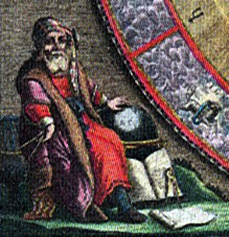
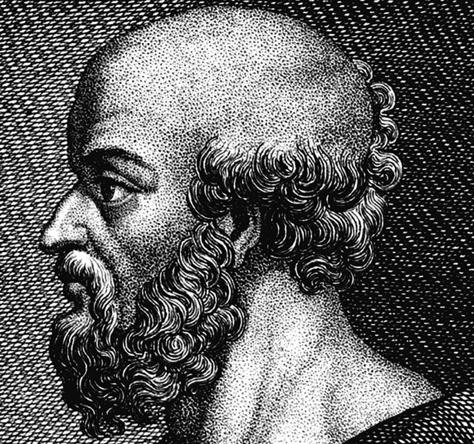
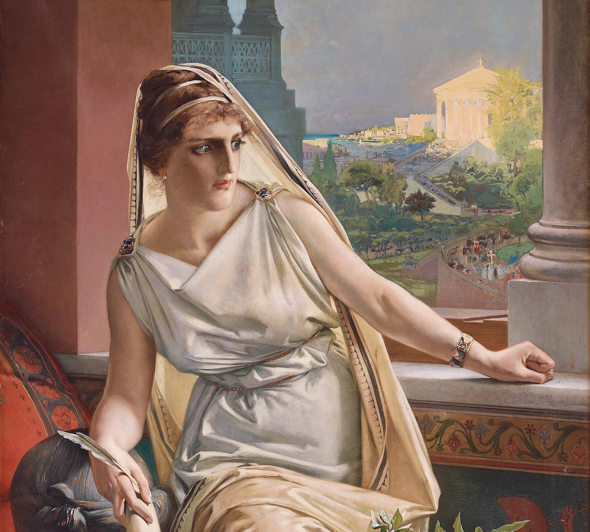
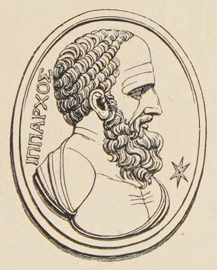
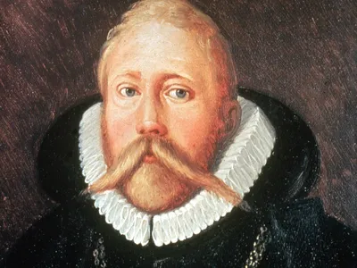
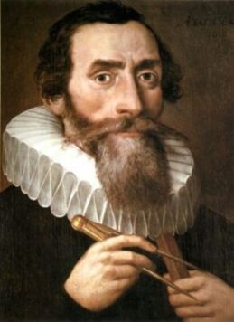

# Biografias de Astrônomos Históricos

```{admonition} Aristarco de Samos
:class: bio

<table>
  <tr>
    <td style="width: 160px;">
      
    </td>
    <td>
      <strong>Aristarco de Samos</strong><br>
      Aristarco foi um astrônomo e matemático grego que propôs, séculos antes de Copérnico, um modelo heliocêntrico do universo, com o Sol no centro e os planetas girando ao seu redor. Ele também tentou estimar o tamanho e a distância da Lua e do Sol em relação à Terra, usando métodos geométricos baseados em observações de eclipses e ângulos aparentes — sendo pioneiro em aplicar trigonometria à astronomia.
    </td>
  </tr>
</table>

```
<!-- 
````{admonition} Eratóstenes de Cirene
:class: bio
```{div} style="display: flex; align-items: flex-start; gap: 1em;"
{width=150}

Eratóstenes foi um polímata grego que, embora mais conhecido por medir com notável precisão o raio da Terra, também fez importantes contribuições à astronomia. Dirigiu a Biblioteca de Alexandria e compilou um catálogo de estrelas e constelações. Sua medição do tamanho da Terra, feita com base na sombra de obeliscos em duas cidades diferentes no solstício, foi fundamental para a compreensão da escala do mundo.
```
````

````{admonition} Hipátia de Alexandria
:class: bio
```{div} style="display: flex; align-items: flex-start; gap: 1em;"
{width=150}

Hipátia foi uma filósofa, matemática e astrônoma de Alexandria, uma das primeiras mulheres cientistas conhecidas. Editou e comentou obras astronômicas clássicas, como o Almagesto de Ptolomeu, e trabalhou no desenvolvimento de instrumentos astronômicos como o astrolábio. Ela representou a continuidade do pensamento astronômico greco-romano na transição para a era cristã.
```
````

````{admonition} Hiparco de Niceia
:class: bio
```{div} style="display: flex; align-items: flex-start; gap: 1em;"
{width=150}

Hiparco é considerado um dos maiores astrônomos da Antiguidade. Ele criou o primeiro catálogo de estrelas com cerca de 850 entradas e classificou-as por magnitude. Descobriu a precessão dos equinócios, desenvolveu métodos para prever eclipses e melhorou os modelos geométricos do movimento solar e lunar. Seu trabalho influenciou diretamente Ptolomeu e o Almagesto.
```
````

````{admonition} Tycho Brahe
:class: bio
```{div} style="display: flex; align-items: flex-start; gap: 1em;"
{width=150}

Tycho Brahe foi um astrônomo dinamarquês que realizou observações extremamente precisas dos corpos celestes antes da invenção do telescópio. Descobriu a supernova de 1572, provando que o céu não era imutável. Embora rejeitasse o heliocentrismo, propôs um modelo híbrido (geo-heliocêntrico). Seus registros detalhados foram fundamentais para os avanços posteriores de Kepler.
```
````

````{admonition} Johannes Kepler
:class: bio
```{div} style="display: flex; align-items: flex-start; gap: 1em;"
{width=150}

Kepler foi um astrônomo e matemático alemão que utilizou os dados de Tycho Brahe para formular as três leis do movimento planetário, demonstrando que os planetas orbitam o Sol em elipses. Defensor do modelo heliocêntrico, Kepler também explorou a óptica astronômica e foi pioneiro na tentativa de entender a física por trás dos movimentos celestes, abrindo caminho para a mecânica celeste de Newton.
```
```` -->